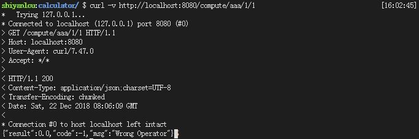
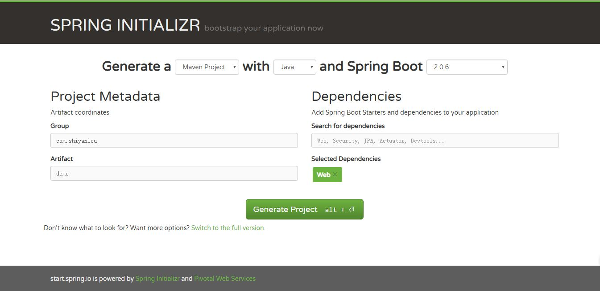
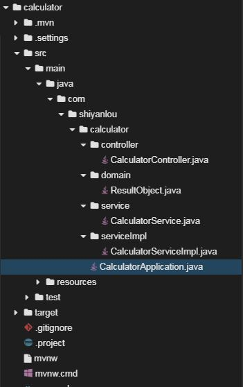
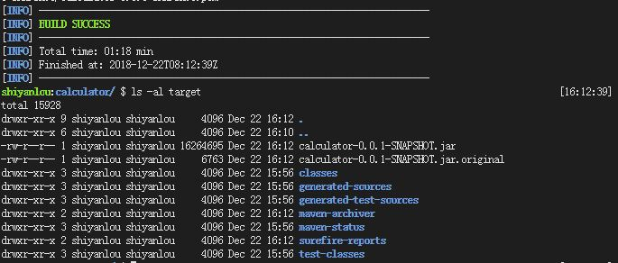
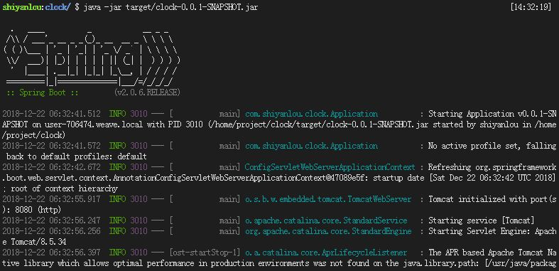

# Spring Boot 快速入门

   * [Spring Boot 快速入门](#spring-boot-快速入门)
      * [一、实验简介](#一实验简介)
         * [1.1 实验内容](#11-实验内容)
         * [1.2 实验知识点](#12-实验知识点)
         * [1.3 效果展示](#13-效果展示)
         * [1.4 实验环境](#14-实验环境)
         * [1.5 项目源码](#15-项目源码)
      * [二、实验步骤](#二实验步骤)
         * [2.1 Spring Boot 概述](#21-spring-boot-概述)
           ​    * [Spring Boot优点](#spring-boot优点)
         * [2.2 文件结构介绍](#22-文件结构介绍)
         * [2.3 项目构建](#23-项目构建)
            * [2.3.1自动构建](#231自动构建)
               * [1. 访问Spring Boot主页](#1-访问spring-boot主页)
               * [2. 下载项目](#2-下载项目)
               * [3. 导入项目工程](#3-导入项目工程)
               * [4. 创建domain文件](#4-创建domain文件)
               * [5. 创建service文件](#5-创建service文件)
               * [6. 创建serviceImpl文件](#6-创建serviceimpl文件)
               * [7. 创建controller文件](#7-创建controller文件)
               * [8. 访问测试](#8-访问测试)
               * [9.打包发布](#9打包发布)
            * [2.3.2 手动构建](#232-手动构建)
               * [1. 创建项目](#1-创建项目)
               * [2. 修改pom文件](#2-修改pom文件)
               * [3. 创建启动类](#3-创建启动类)
               * [4. 创建domain文件](#4-创建domain文件-1)
               * [5. 创建service文件](#5-创建service文件-1)
               * [6. 创建serviceImpl文件](#6-创建serviceimpl文件-1)
               * [7. 创建controller文件](#7-创建controller文件-1)
               * [8. 访问测试](#8-访问测试-1)
               * [9.打包发布](#9打包发布-1)
      * [三、实验总结](#三实验总结)

##  一、实验简介

### 1.1 实验内容
​	本实验主要对Spring Boot进行一个初步介绍，让大家从整体上对Spring Boot有一个认识，然后我们给大家介绍一下Spring Boot的目录文件，接着先通过自动构建项目方式创建项目，开发一个提供计算器功能的Web网站，最后通过手动构建项目方式创建项目，开发一个提供计算日期差的Web网站。

### 1.2 实验知识点

- Spring Boot入门介绍
- Spring Boot目录结构介绍
- maven构建项目
- Spring Boot简单开发

### 1.3 效果展示

​	第一个项目主要功能就是实现一个计算器，URL前缀是`http://localhost:8080/compute/` 

- 第一个`PathVariable`可以是add、subtract、divide、multiply

- 第二、第三个`PathVariable`是两个操作数

  如果操作数正确，可以返回计算结果，如果输入有误，后台拒绝计算，并且返回错误原因。




​	第二个项目主要功能就是实现计算两个日期差，URL前缀是`http://localhost:8080/clock/get` ，两个`PathVariable`分别是两个日期，如果日期格式正确，可以返回计算结果，如果输入有误，后台返回错误原因。


### 1.4 实验环境

- eclipse Neon.2 Release (4.6.2)
- jdk 1.8
- maven 3.5
- Spring Boot 2.0.6
- curl

### 1.5 项目源码

本实验的源码可以按如下方式获得

```shell
$ wget http://labfile.oss.aliyuncs.com/courses/xxx/lesson_1.zip
```

## 二、实验步骤

### 2.1 Spring Boot 概述
​	在学习Spring Boot之前大家一定使用过Spring，在使用Spring开发过程中，其繁琐的配置文件一定使大家十分烦恼。于是在此情况之下，Pivotal团队提供了全新的框架，其设计目的就是简化Spring应用环境的搭建，提高开发效率。Spring Boot致力成为快速应用开发领域的领导者。

##### Spring Boot优点
- 简化配置
- 与其他常用工具（MySQL、redis、MQ、elasticsearch等）完美结合
- 内嵌Tomcat，无需产生war包部署、测试，单一jar包部署，非常适合构建微服务
- 提供生产环境必要功能：健康检查、外部配置

### 2.2 文件结构介绍
- `src/main/java`  程序开发以及主程序入口
  - `Application.java` 作为程序主入口，建议放到根目录下面，主要用于做一些框架配置
  - `controller` 目录主要存放页面访问控制代码
  - `service` 目录主要存放业务接口代码
  - `serviceImpl` 目录主要存放业务实现代码
  - `domain` 目录主要存放实体代码
  - `dao` 目录主要存放mapper接口
- `src/main/resources` 存放项目资源文件
  - `application.properties` 主要配置文件
  - `mapper`  mapper xml代码
- `src/test/java`  存放所有测试代码
- `src/test/resources` 存放项目测试时资源文件
- `target`  项目输出位置，如编译产生的jar包等
- `pom.xml` maven依赖此文件构建项目，主要包含项目依赖等内容，使用xml编写

### 2.3 项目构建

#### 2.3.1自动构建

##### 1. 访问Spring Boot主页

`访问Spring Initializr网址` [http://start.spring.io](http://start.spring.io)


##### 2. 下载项目

`选择Maven Project、Java、Spring Boot 2.0.7构建项目，Group即pom.xml中的groupId，即项目所属组织，一般为反向的公司域名，例如：com.shiyanlou，Artifact即pom.xml中的artifactId，即项目名称，例如：calculator，依赖选择web ，点击Switch to full version ，Java version选择8，最后点击Generate Project下载工程压缩包，如下图所示。`




##### 3. 导入项目工程

step 1、2由于实验环境的原因，大家可以在自己的计算机上尝试，这里给出已经下载好的压缩包。大家可以按如下方式下载解压使用。在终端中输入如下命令

```shell
$ wget http://labfile.oss.aliyuncs.com/courses/xxx/calculator.zip
$ unzip calculator.zip -d ./
$ rm -rf calculator.zip
```

然后在web IDE界面中，选择File -> Open Workspace切换工作空间，选择calculator目录，必须切换到该目录下，否则识别不了项目。

最后大家可以根据下图所示的目录结构，自己创建目录、文件，较为简单，无需赘述。



##### 4. 创建domain文件

  ```java
package com.shiyanlou.calculator.domain;

// 封装后端返回结果
public class ResultObject {

  	// 计算结果
	private double result;
  	// 返回码
	private int code;
  	// 返回消息
	private String msg;

  	// 构造函数
	public ResultObject() {
		super();
		// TODO Auto-generated constructor stub
	}
	
  	// 构造函数
	public ResultObject(double result, int code, String msg) {
		super();
		this.result = result;
		this.code = code;
		this.msg = msg;
	}

  	// 属性的getter、setter方法
	public double getResult() {
		return result;
	}

	public void setResult(double result) {
		this.result = result;
	}

	public int getCode() {
		return code;
	}

	public void setCode(int code) {
		this.code = code;
	}

	public String getMsg() {
		return msg;
	}

	public void setMsg(String msg) {
		this.msg = msg;
	}

  	// 重写toString方法
	@Override
	public String toString() {
		return "ResultObject [result=" + result + ", code=" + code + ", msg=" + msg + "]";
	}
}
  ```


##### 5. 创建service文件

  ```java
package com.shiyanlou.calculator.service;

import com.shiyanlou.calculator.domain.ResultObject;
// service接口
public interface CalculatorService {
	/**
	 * 计算
	 * @param operator 操作符
	 * @param firstNum 第一个操作数
	 * @param secondNum 第二个操作数
	 * @return 响应结果
	 */
	public ResultObject compute(String operator, double firstNum, double secondNum);
}
  ```


##### 6. 创建serviceImpl文件

  ```java
package com.shiyanlou.calculator.serviceImpl;

import org.springframework.stereotype.Service;

import com.shiyanlou.calculator.domain.ResultObject;
import com.shiyanlou.calculator.service.CalculatorService;

// service 实现类
@Service
public class CalculatorServiceImpl implements CalculatorService{

  	/**
	 * 计算
	 * @param operator 操作符
	 * @param firstNum 第一个操作数
	 * @param secondNum 第二个操作数
	 * @return 响应结果
	 */
	@Override
	public ResultObject compute(String operator, double firstNum, double secondNum) {
      	// 结果
		double result = 0;
      	// 返回码
		int code = 200;
      	// 返回消息
		String msg = "";
      	// 封装对象
		ResultObject resultObject;

      	// 根据不同的操作符进行不同的操作
		switch (operator) {
        // 加
		case "add":
			result = firstNum + secondNum;
			break;
		// 减
		case "subtract":
			result = firstNum - secondNum;
			break;
		// 除
		case "divide":
            // 除数为0，无法计算
			if (secondNum == 0) {
				msg = "Wrong Parameter";
				code = -1;
				break;
			} else {
				result = firstNum / secondNum;
			}
			break;
		// 乘
		case "multiply":
			result = firstNum * secondNum;
			break;

        // 未知的操作符，无法计算
		default:
			msg = "Wrong Operator";
			code = -1;
			break;
		}
		// 返回结果
		resultObject = new ResultObject(result, code, msg);
		return resultObject;
	}
}
  ```


##### 7. 创建controller文件

  ``` java
 package com.shiyanlou.calculator.controller;

import org.springframework.beans.factory.annotation.Autowired;
import org.springframework.web.bind.annotation.PathVariable;
import org.springframework.web.bind.annotation.RequestMapping;
import org.springframework.web.bind.annotation.RestController;

import com.shiyanlou.calculator.domain.ResultObject;
import com.shiyanlou.calculator.service.CalculatorService;

@RestController
public class CalculatorController {

  	// 自动注入service
	@Autowired
	private CalculatorService sampleService;

  	// 默认请求方法类型为get，URL：/compute/{operator}/{firstNum}/{secondNum}
  	/**
	 * 计算
	 * @param operator 操作符
	 * @param firstNum 第一个操作数
	 * @param secondNum 第二个操作数
	 * @return 响应结果
	 */
	@RequestMapping("/compute/{operator}/{firstNum}/{secondNum}")
	public ResultObject compute(@PathVariable String operator,
			@PathVariable double firstNum, @PathVariable double secondNum) {
		ResultObject resultObject = sampleService.compute(operator, firstNum, secondNum);
		return resultObject;
	}
}
  ```


##### 8. 访问测试

在终端中输入如下命令，可以看到控制台打印出启动日志

```shell
$ mvn spring-boot:run
```

File -> Open New Terminal，再打开一个终端，在终端中输入如下命令

```shell
$  curl -v http://localhost:8080/compute/add/1/1
```


##### 9.打包发布

在第一个终端中按下`Ctrl + C`，杀掉web进程。在终端中输入如下命令，使用maven打包发布

```shell
$ mvn install
```
看到终端显示绿色`BUILD SUCCESS`，说明打包成功，输入如下命令，可以查看编译结果
```shell
$ ls -al target
```



输入如下命令，可以启动web服务，如下图所示启动成功
```shell
$ java -jar target/calculator-0.0.1-SNAPSHOT.jar                                                          
```


可以在另外一个终端中测试


#### 2.3.2 手动构建

##### 1. 创建项目

在web IDE界面中，选择File -> Open New Terminal，在终端中输入

```shell
$ mvn archetype:generate -DgroupId=com.shiyanlou -DartifactId=clock -DarchetypeArtifactId=maven-archetype-webapp
```

参数介绍：

- `archetype:generate`：表示使用maven创建项目基本骨架
- `DgroupId`：该项目所属组织，一般将域名倒着写，例如：com.shiyanlou
- `DartifactId`：项目名称，例如：clock
- `DarchetypeArtifactId`：指定所用maven项目骨架类型

输入命令后，maven开始创建项目、下载所需的依赖，等待片刻，maven提示我们输入版本号，直接回车，我们使用默认版本号`1.0-SNAPSHOT`即可。随后maven会输出`groupId`、`artifactId`、`version`、`package`这些基本信息，直接输入`Y`确认即可。最后可以看到绿色的`BUILD SUCCESS`项目创建成功的提示。

然后在web IDE界面中，选择File -> Open Workspace切换工作空间，选择clock目录，必须切换到该目录下，否则识别不了项目。

最后大家可以根据下图所示的目录结构，自己创建目录、文件，较为简单，无需赘述。


##### 2. 修改pom文件

`将如下配置文件覆盖到pom.xml中`

   ```xml
<project xmlns="http://maven.apache.org/POM/4.0.0" xmlns:xsi="http://www.w3.org/2001/XMLSchema-instance" xsi:schemaLocation="http://maven.apache.org/POM/4.0.0 http://maven.apache.org/xsd/maven-4.0.0.xsd">
  <modelVersion>4.0.0</modelVersion>
  <groupId>com.shiyanlou</groupId>
  <artifactId>clock</artifactId>
  <version>0.0.1-SNAPSHOT</version>

  	<!--设置父模块 这样就可以继承父模块中的配置信息 -->
  	<parent>
   		<groupId>org.springframework.boot</groupId>
   		<artifactId>spring-boot-starter-parent</artifactId>
   		<version>2.0.6.RELEASE</version>
   		<relativePath/> <!-- lookup parent from repository -->
   	</parent>

   	<properties>
   		<project.build.sourceEncoding>UTF-8</project.build.sourceEncoding>
   		<project.reporting.outputEncoding>UTF-8</project.reporting.outputEncoding>
   		<java.version>1.8</java.version>
   	</properties>

   	<dependencies>
   		<!-- 添加web依赖 -->
   		<dependency>
   			<groupId>org.springframework.boot</groupId>
   			<artifactId>spring-boot-starter-web</artifactId>
   		</dependency>
   	</dependencies>

   	<build>
   		<plugins>
   		    <!--spirng Boot maven插件-->
   			<plugin>
   				<groupId>org.springframework.boot</groupId>
   				<artifactId>spring-boot-maven-plugin</artifactId>
   			</plugin>
   		</plugins>
   	</build>
</project>
   ```


##### 3. 创建启动类

启动类是整个程序的启动入口，Spring Boot内嵌一个Tomcat，故可以直接启动

```java
package com.shiyanlou.clock;

import org.springframework.boot.SpringApplication;
import org.springframework.boot.autoconfigure.SpringBootApplication;

// @SpringBootApplication = @Configuration + @EnableAutoConfiguration + @ComponentScan，简化配置
@SpringBootApplication
public class Application {

	public static void main(String[] args) {
      	// 启动内嵌的Tomcat并初始化spring环境及其组件
		SpringApplication.run(Application.class, args);
	}
}
```


##### 4. 创建domain文件

创建`ResultObject` 用来封装返回数据。

```java
package com.shiyanlou.clock.domain;

public class ResultObject {

    // 结果
	private double result;
  	// 状态
	private String status;
    // 原因
	private String reason;

   	// 构造函数
	public ResultObject() {
		super();
		// TODO Auto-generated constructor stub
	}

  	// 构造函数
	public ResultObject(double result, String status, String reason) {
		super();
		this.result = result;
		this.status = status;
		this.reason = reason;
	}
  
    // 以下均是getter、setter方法
	public double getResult() {
		return result;
	}
  
  	public void setResult(double result) {
		this.result = result;
	}

	public String getStatus() {
		return status;
	}

	public void setStatus(String status) {
		this.status = status;
	}

	public String getReason() {
		return reason;
	}

	public void setReason(String reason) {
		this.reason = reason;
	}

  	// 重写toString方法
	@Override
	public String toString() {
		return "ResultObject [result=" + result + ", status=" + status + ", reason=" + reason + "]";
	}
}
```


##### 5. 创建service文件

```java
package com.shiyanlou.clock.service;

import com.shiyanlou.clock.domain.ResultObject;

// service 接口
public interface ClockService {

  	/**
	 * 功能：获取两个日期差值
	 * @param firstDate 第一个日期
	 * @param lastDate 第二个日期
	 * @return 响应结果
	 */
	public ResultObject getDiff(String firstDate, String lastDate);
}
```


##### 6. 创建serviceImpl文件

```java
package com.shiyanlou.clock.serviceImpl;

import java.text.SimpleDateFormat;
import java.util.Date;

import org.springframework.stereotype.Service;

import com.shiyanlou.clock.domain.ResultObject;
import com.shiyanlou.clock.service.ClockService;

// service 实现类
@Service
public class ClockServiceImpl implements ClockService{

  	/**
	 * 功能：获取两个日期差值
	 * @param firstDate 第一个日期
	 * @param lastDate 第二个日期
	 * @return 响应结果
	 */
	public ResultObject getDiff(String firstDate, String lastDate){
		ResultObject resultObject = null;

      	// 设置解析格式
		SimpleDateFormat dateFormat = new SimpleDateFormat("yyyy-MM-dd");
		Date formatFirstDate = null, formatLastDate = null;

		try {
          	// 解析参数
			formatFirstDate = dateFormat.parse(firstDate);
			formatLastDate = dateFormat.parse(lastDate);
		} catch (Exception e) {
          	// 若有异常，直接返回失败
			resultObject = new ResultObject(0, "fail", "parameter error");
			return resultObject;
		}
      	// 计算差值，单位为毫秒，所以需要 /(24 * 60 * 60 * 1000)
		long day = (formatFirstDate.getTime() - formatLastDate.getTime()) / (24 * 60 * 60 * 1000);
      	// 返回正确结果
		resultObject = new ResultObject(day, "success", "");
		return resultObject;
	}
}
```


##### 7. 创建controller文件

```java
package com.shiyanlou.clock.controller;

import org.springframework.beans.factory.annotation.Autowired;
import org.springframework.web.bind.annotation.GetMapping;
import org.springframework.web.bind.annotation.PathVariable;
import org.springframework.web.bind.annotation.RequestMapping;
import org.springframework.web.bind.annotation.RestController;

import com.shiyanlou.clock.domain.ResultObject;
import com.shiyanlou.clock.service.ClockService;

// @RestController注解相当于@ResponseBody ＋ @Controller
@RestController
@RequestMapping("clock")
public class ClockController {

  	// 自动注入service
	@Autowired
	ClockService clockService;

  	// @GetMapping是一个组合注解 是@RequestMapping(method = RequestMethod.GET)的缩写
  	 /**
	 * 功能：获取两个日期差值
	 * @param firstDate 第一个日期
	 * @param lastDate 第二个日期
	 * @return 响应结果
	 */
	@GetMapping("get/{firstDate}/{lastDate}")
	public ResultObject getClock(@PathVariable String firstDate, @PathVariable String lastDate) {
		ResultObject resultObject = clockService.getDiff(firstDate, lastDate);
		return resultObject;
	}
}
```

##### 8. 访问测试

在终端中输入如下命令，可以看到控制台打印出启动日志

```shell
$ mvn spring-boot:run
```

File -> Open New Terminal，再打开一个终端，在终端中输入如下命令

```shell
$ curl -v http://localhost:8080/clock/get/2018-11-10/2018-11-01
```


##### 9.打包发布

在第一个终端中按下`Ctrl + C`，杀掉web进程。在终端中输入如下命令，使用maven打包发布

```shell
$ mvn install
```
看到终端显示绿色`BUILD SUCCESS`，说明打包成功，输入如下命令，可以查看编译结果
```shell
$ ls -al target
```


输入如下命令，可以启动web服务，如下图所示启动成功
```shell
$ java -jar target/clock-0.0.1-SNAPSHOT.jar                                                           
```



可以在另外一个终端中测试


## 三、实验总结

​	本节课先对Spring Boot进行一个基本介绍，让学员有一个整体的认识，然后对Spring Boot的目录结构做了一个介绍。接着使用两种方式通过maven构建两个简单项目，让学员有一个直观的体验。