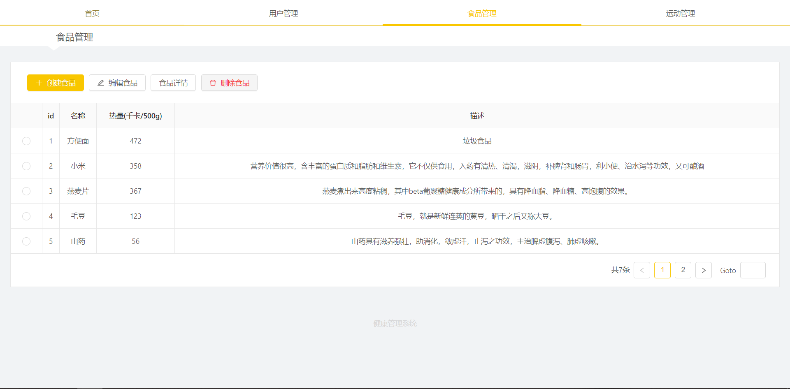
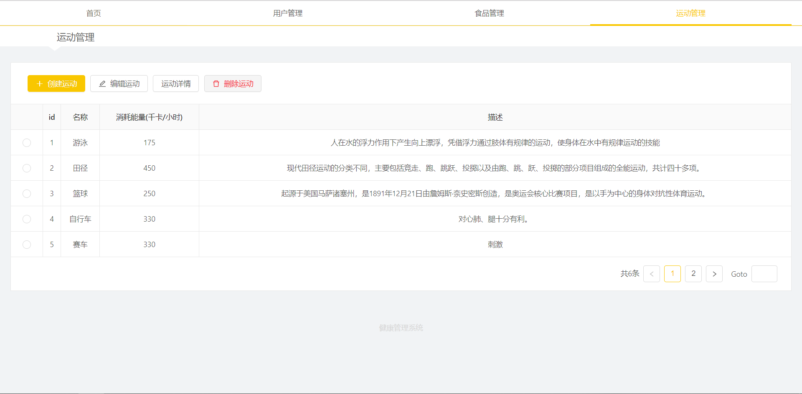
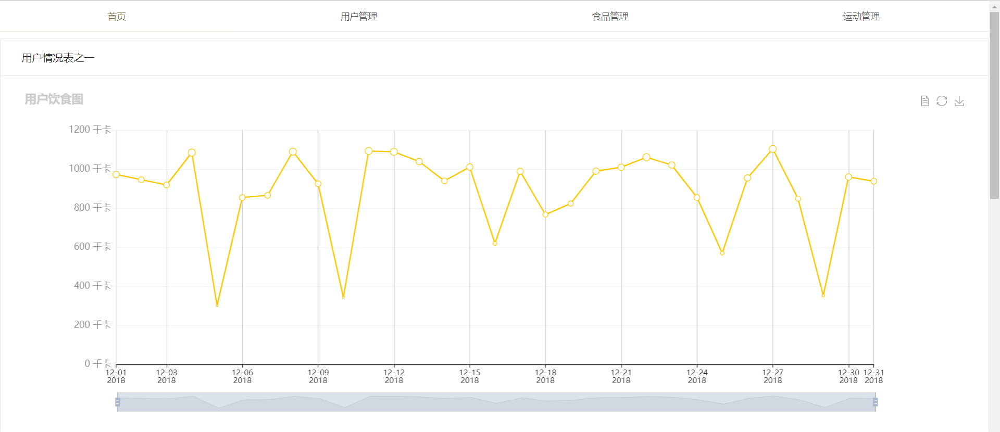
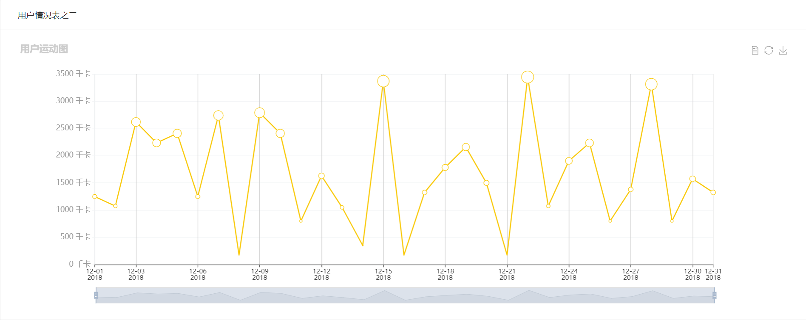
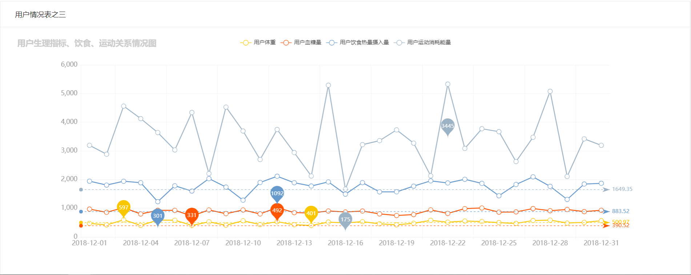

# 前端展示

##  一、实验简介

### 1.1 实验内容
​	前面四节实验课是健康管理系统的后端部分，本节实验课为大家展示健康管理系统的前端部分，后端代码使用前几节课完成的，由于本课程是为后端程序员准备，前端代码大家直接下载即可，不再详细解释。

### 1.2 实验知识点

- 前端、后端整合

### 1.3 实验环境

- Eclipse Neon.2 Release (4.6.2)
- Java 1.8
- Maven 3.5
- Spring Boot 2.0.6
- Mybatis 3.4.6
- MySQL 5.7
- React
- antD
- echart

## 二、实验步骤

#### 2.1 下载代码

下载后端代码

```shell
$ wget http://labfile.oss.aliyuncs.com/courses/xxx/lesson_10.zip
```

下载前端代码

```shell
$ wget http://labfile.oss.aliyuncs.com/courses/xxx/front-end.zip
```


#### 2.2 创建数据库和数据表

启动MySQL数据库服务

```sh
$ sudo service mysql start
```

进入MySQL数据库

```sh
$ mysql -uroot -p
```

创建数据库

```sql
mysql> create database lesson7; 
```

导入数据表

```sh
$ mysql -uroot lesson7 < dump.sql
```


#### 2.3 安装前端环境

更新安装源

```shell
$ sudo apt-get update
```


- 安装`node`和`npm`

```shell
$ sudo apt-get -y install nodejs
$ sudo apt-get -y install npm
```


#### 2.4 访问测试

##### 2.4.1 启动后端java项目

在终端中输入如下命令，启动java web项目

```shell
$ mvn spring-boot:run
```

##### 2.4.2修改react端口

修改react启动端口为8080，在前端项目路径中找到`/front-end/health/node_modules/react-scripts/start.js` 这个文件，搜索默认的`3000`端口，替换为`8080`

##### 2.4.3启动前端react项目

打开另外一个终端中输入如下命令，安装相关的包，并且前端项目

```shell
$ npm install
$ npm start
```

##### 2.4.4连接web服务

点击工具-Web服务，打开以下网页测试

- 用户管理


- 食品管理



- 运动管理



- 用户饮食图



- 用户运动图



- 用户生理指标、饮食、运动关系图




## 三、实验总结

​	在当前环境下，web开发项目绝大多数都是前后端分离模式，越来越多的企业都开始往这个方向靠拢。本项目紧跟当前潮流，为大家展示了一个完整的前后端分离的项目。本节实验课给出了前端主要代码，与前几节讲解的后端代码相结合。